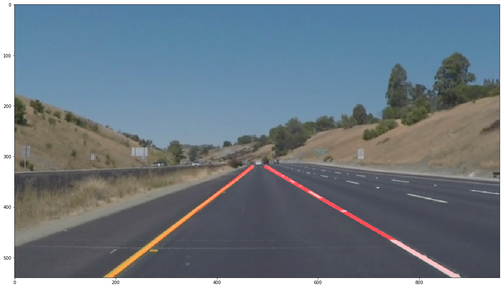

#**Finding Lane Lines on the Road** 
## by Abelardo Marquez

The goals / steps of this project are the following:

- Make a pipeline that finds lane lines on the road
- Reflect on your work in a written report

---

### Reflection

###1. Describe your pipeline. As part of the description, explain how you modified the draw_lines() function.

My pipeline consisted on the following 5 steps: 

1. Grayscale tranformation
2. Gaussian smoothing
3. Canny Edge Detection
4. Set Mask
5. Hough Transform
 - Linear Regression
 - Drawing of lines 

First the **Grayscale transformation** of the image is required in order to help on detecting the image edges. Then I applied a **gaussian smoothing** with a kernel of 3. Next comes the **Canny Edge Detection** algorithm where I choosed a range of (50,150) following John Canny suggestions of a ratio of 1:2 or 1:3.

I set a **polygon mask** based on the dimensions of the image and visuals, this points are defined on the `vertices` function.

Then I run the **Hough Transform** function with (1) calculates the lines inside the masked region (2) and *in order to display a single line* for each side of the road, I modify the `draw_lines` function by applying linear regression on the obtained points (3) and then draw the resulting line. 
 
 The result is displayed on the following image:
 
 

###2. Identify potential shortcomings with your current pipeline

One of the shortcoming on my pipeline is regarding the selected method to draw a single straight line. As I choosed Linear regresion, **if another lines are detected on the road with a different slope** the resulting line could have a very different slope. 

In fact, when testing this pipeline on the video with the Yellow Line, the pipeline can't handle the changes on the road.

Another shortcoming could be if the lines are on a different color or on a not so contrating color, so a straight line would be hard to detect. 

Also the presence of shadows seems to mess the calculations.

###3. Suggest possible improvements to your pipeline

A possible improvement would be to change the way I calculate the average resulting slope. Maybe using a calculation that instead of taking in account the points, take in account line with similar slopes. Perhaps using the mode of the slope values. 

Maybe the creation of two masks, so what happens on one side, don't disturb the edge calculation on the other side.

Another potential improvement could be to somehow increase the contrast to accentuate the edges somehow. 

Also a way to detect shadow would be helpful to somehow avoid it on the calculation, if this is somehow possible. 